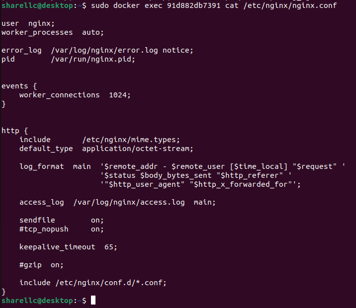
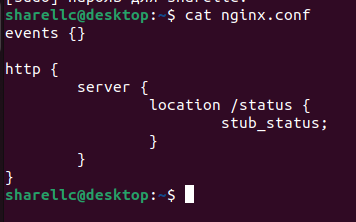
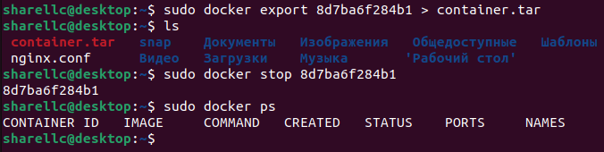
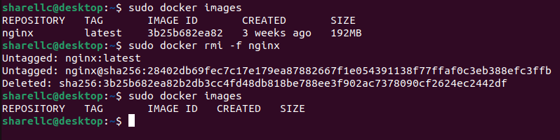
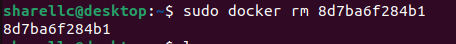
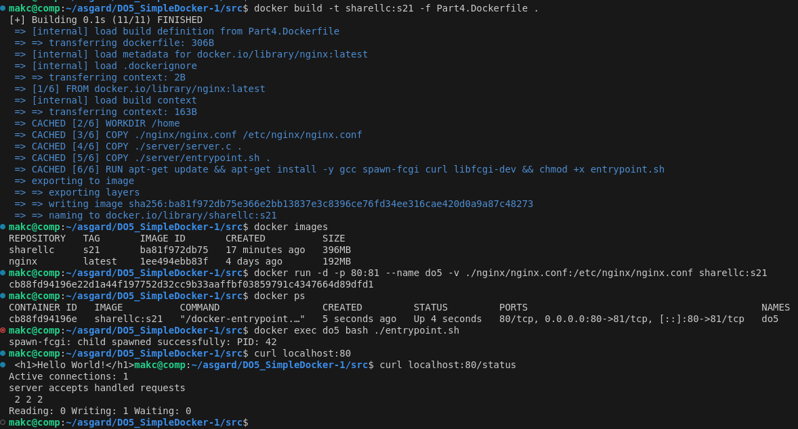
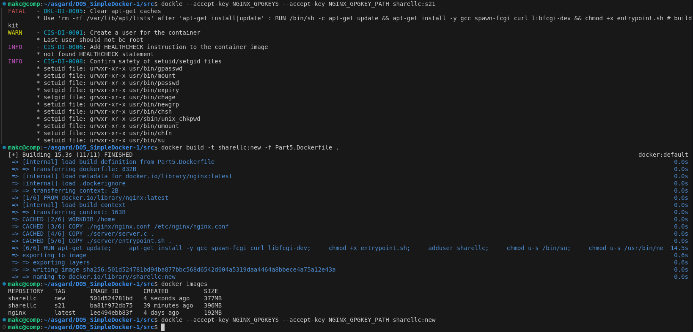
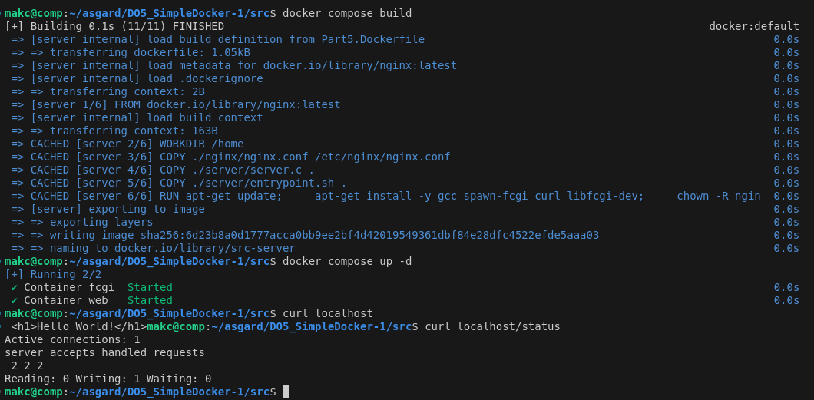

## Part 1. Готовый докер

Возьми официальный докер-образ с nginx и выкачай его при помощи docker pull.

> Установим docker-образ с помощью команды `pull`

Проверь наличие докер-образа через docker images.
Запусти докер-образ через docker run -d [image_id|repository].
Проверь, что образ запустился через docker ps.

> Смотрим наличие образа с помощью команды `images`, запускаем образ через `run -d`, проверяем запуск образа через `ps`

Посмотри информацию о контейнере через docker inspect [container_id|container_name].
По выводу команды определи и помести в отчёт размер контейнера, список замапленных портов и ip контейнера.

> С помощью команды `inspect` смотрим подробную информацию о контейнере, опции `-s` добавляет доп поля в вывод `-f` форматирует вывод по шаблону. 
> - SizeRw - размер файлов, которые были созданы или изменены в байтах
> - SizeRootFs - общий размер всех файлов в байтах
> - Ports - замапленные порты
> - IPAddress - ip адрес

Останови докер контейнер через docker stop [container_id|container_name].
Проверь, что контейнер остановился через docker ps.

> Останавливаем контейнер командой `stop`, проверяем командой `ps`

Запусти докер с портами 80 и 443 в контейнере, замапленными на такие же порты на локальной машине, через команду run.
Проверь, что в браузере по адресу localhost:80 доступна стартовая страница nginx.

> Запусаем контейнер с портами 80 и 443 командой `run -d -p 80:80 -p 443:443`. Проверяем в браузере

Перезапусти докер контейнер через docker restart [container_id|container_name].
Проверь любым способом, что контейнер запустился.

> Перезапускаем контейнер командой `restart`. Смотрим в браузере

## Part 2. Операции с контейнером

Прочитай конфигурационный файл nginx.conf внутри докер контейнера через команду exec.

> Смотрим кофигурационный файл nginx.conf командой `exec`

Создай на локальной машине файл nginx.conf.
Настрой в нем по пути /status отдачу страницы статуса сервера nginx.

> Создаем файл nginx.conf и прописываем отдачу страницы статуса по пути /status

Скопируй созданный файл nginx.conf внутрь докер-образа через команду docker cp.
Перезапусти nginx внутри докер-образа через команду exec.
Проверь, что по адресу localhost:80/status отдается страничка со статусом сервера nginx.

> Копируем файл nginx.conf внутрь образа командой `cp`, перезапускаем образ nginx командой `exec ... -s reload`, смотрим в браузере статус сервера по пути localhost:80/status

Экспортируй контейнер в файл container.tar через команду export.
Останови контейнер.

> Экспортируем контейнер командой `export`, останавливаем контейнер командой `stop`

Удали образ через docker rmi [image_id|repository], не удаляя перед этим контейнеры.

> Удаляем образ командой `rmi -f`

Удали остановленный контейнер.

> Удаляем контейнер командой `rm`

Импортируй контейнер обратно через команду import.
Запусти импортированный контейнер.
Проверь, что по адресу localhost:80/status отдается страничка со статусом сервера nginx.

> Импортируем контейнер из container.tar командой `import -c ...`, запускаем этот контейнер и проверяем в браузере отдается ли страница статуса по адресу localhost:80/status

## Part 3. Мини веб-сервер

Напиши мини-сервер на C и FastCgi, который будет возвращать простейшую страничку с надписью Hello World!.
Запусти написанный мини-сервер через spawn-fcgi на порту 8080.
Напиши свой nginx.conf, который будет проксировать все запросы с 81 порта на 127.0.0.1:8080.
Проверь, что в браузере по localhost:81 отдается написанная тобой страничка.
Положи файл nginx.conf по пути ./nginx/nginx.conf (это понадобится позже).

\

> команды в части 3

## Part 4. Свой докер

Напиши свой докер-образ, который:
1) собирает исходники мини сервера на FastCgi из Части 3;
2) запускает его на 8080 порту;
3) копирует внутрь образа написанный ./nginx/nginx.conf;
4) запускает nginx.
nginx можно установить внутрь докера самостоятельно, а можно воспользоваться готовым образом с nginx'ом, как базовым.
Собери написанный докер-образ через docker build при этом указав имя и тег.
Проверь через docker images, что все собралось корректно.
Запусти собранный докер-образ с маппингом 81 порта на 80 на локальной машине и маппингом папки ./nginx внутрь контейнера по адресу, где лежат конфигурационные файлы nginx'а (см. Часть 2).
Проверь, что по localhost:80 доступна страничка написанного мини сервера.
Допиши в ./nginx/nginx.conf проксирование странички /status, по которой надо отдавать статус сервера nginx.
Перезапусти докер-образ.
Если всё сделано верно, то, после сохранения файла и перезапуска контейнера, конфигурационный файл внутри докер-образа должен обновиться самостоятельно без лишних действий.
Проверь, что теперь по localhost:80/status отдается страничка со статусом nginx

> команды в части 4

## Part 5. Dockle

Просканируй образ из предыдущего задания через dockle [image_id|repository].
Исправь образ так, чтобы при проверке через dockle не было ошибок и предупреждений.

> команды в части 5

## Part 6. Базовый Docker Compose

Напиши файл docker-compose.yml, с помощью которого:
1) Подними докер-контейнер из Части 5 (он должен работать в локальной сети, т. е. не нужно использовать инструкцию EXPOSE и мапить порты на локальную машину).
2) Подними докер-контейнер с nginx, который будет проксировать все запросы с 8080 порта на 81 порт первого контейнера.
Замапь 8080 порт второго контейнера на 80 порт локальной машины.
Останови все запущенные контейнеры.
Собери и запусти проект с помощью команд docker-compose build и docker-compose up.
Проверь, что в браузере по localhost:80 отдается написанная тобой страничка, как и ранее.

> команды в части 6
